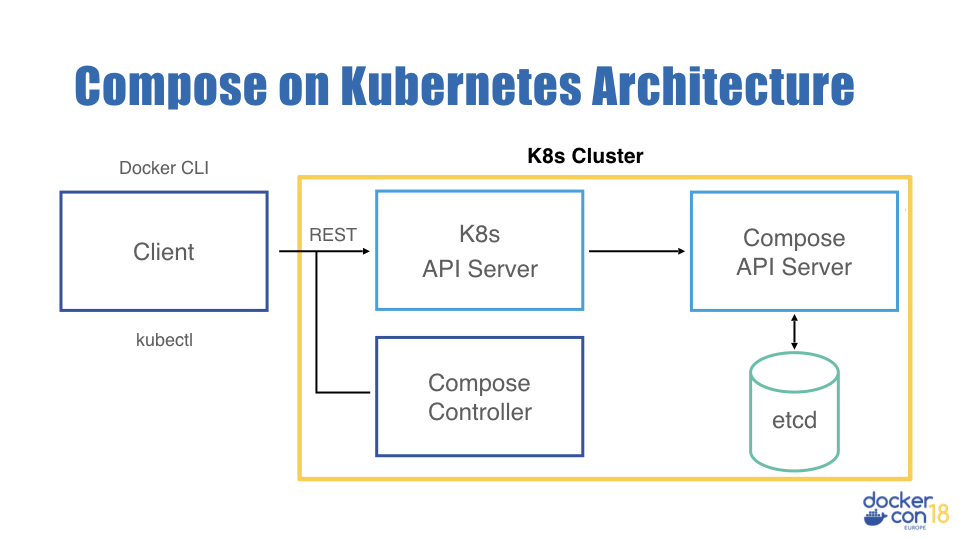

# Architecture

Compose on Kubernetes is made up of server-side and client-side components. This
architecture was chosen so that the entire life cycle of a stack can be managed.
The following image is a high-level diagram of the architecture:

The REST API is provided by a custom API server exposed to Kubernetes clients
using [API server aggregation](https://kubernetes.io/docs/concepts/extend-kubernetes/api-extension/custom-resources/#api-server-aggregation).

The client communicates with the server using a declarative REST API. It creates
a stack by either POSTing a serialized stack struct (v1beta2) or a Compose file
(v1beta1) to the API server. This API server stores the stack in an etcd
key-value store.

The REST API is declarative meaning that the stack stored in etcd is considered
the desired state. The Compose controller is responsible for breaking the stack
up into Kubernetes components, reconciling the current cluster state with the
desired state, and aggregating the stack status.

## Server-side architecture

There are two server-side components in Compose on Kubernetes: the Compose API
server, and the Compose controller.

The Compose API server extends the Kubernetes API by adding routes for creating
and manipulating stacks. It is responsible for storing the stacks in an etcd
key-value store. It also contains the logic to convert v1beta1 representations
to v1beta2, so that the Compose controller only needs to work one representation
of a stack.

The Compose controller is responsible for converting a stack struct (v1beta2
schema) into Kubernetes objects and then reconciling the current cluster state
with the desired one. It does this by interacting with the Kubernetes API -- it
is a Kubernetes client that watches for interesting events and manipulates lower
level Kubernetes objects.

### API server

While API aggregation is more complex than a CRD (Custom Resource Definition),
it brings much more flexibiliy. This includes but is not limited to:
subresources, non-trivial validation, and user identity recording. Instead of
relying on Kubernetes to create the API endpoints and logic for storing and
manipulating stack objects, Compose on Kubernetes deploys a custom API server to
do this. As part of the install process, the component is registered with the
Kubernetes API server for API aggregation so that it is forwarded all requests
on the `compose.docker.com/` group route.

### Compose controller

The Compose controller fetches the desired stack from the API server. This
struct is then cut up into Kubernetes resources which the controller creates and
manipulates through the Kubernetes API server. The mapping for this can be found
in [mapping.md](./mapping.md).

The API server also records user identity, group membership and claims on stack
creations and updates, and exposes them as a subresource. The Controller
consumes this subresource to impersonate this user, to create Kubernetes objects
with the user identity.

## Client-side architecture

The code for the Docker CLI implementation of the client can be found [here](https://github.com/docker/cli/tree/master/kubernetes/compose).

### v1beta1

The v1beta1 API requires that the client uploads a Compose file to describe the
stack. This was used in early versions of Compose on Kubernetes and is used by
Docker Enterprise 2.0.

In the medium-term, we aim to deprecate this API.

### v1beta2

The v1beta2 API requires that the client parses the Compose file and uploads a
stack struct. This is used by the Docker CLI by default.
