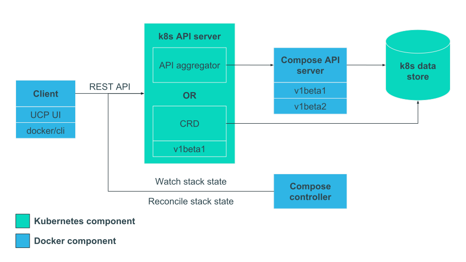

# Architecture

Compose on Kubernetes is made up of server-side and client-side components.
This architecture was chosen so that we could keep the code which does the
actual translation from stack objects to Kubernetes objects server-side and thus
proprietary.

There are also two different implementations of Compose on Kubernetes that have
been developed: v0.2 and earlier which uses a CRD
([Custom Resource Definition](https://kubernetes.io/docs/concepts/extend-kubernetes/api-extension/custom-resources/#customresourcedefinitions))
for the server-side REST store component and v0.3 and later which uses
[API server aggregation](https://kubernetes.io/docs/concepts/extend-kubernetes/api-extension/custom-resources/#api-server-aggregation).

Below is a diagram showing the general architecture of Compose on Kubernetes.

The client communicates with the server using a REST API. It creates a stack by
either POSTing a serialized stack struct (v1beta2) or a Compose file (v1beta1)
to the REST store component. This REST store component stores the stack in the
Kubernetes data store. Versions v0.2 and earlier use a CRD to provide this while
v0.3 and later use API aggregation.

The stack stored in the Kubernetes data store is considered the desired state.
The Compose controller is responsible for cutting the stack up into Kubernetes
components, reconciling the current cluster state with the desired state, and
aggregating the stack status.

Manipulations of the stack are performed by the client using the REST API
provided by the REST store component.

## Server-side architecture

There are two server-side components in both implementations of Compose for
Kubernetes: the REST store (either a CRD or an API server), and the Compose
controller (shared by both).

The REST store extends the Kubernetes API by adding routes for creating and
manipulating stacks. It also stores the stacks into the Kubernetes data store.
The Compose controller is responsible for converting either a Compose file
(v1beta1) or a stack struct (v1beta2) into Kubernetes objects and then
reconciling the current cluster state with the desired one.

### REST store

#### CRD (v0.2 and earlier)

The CRD implementation of the REST store is defined by a YAML file that is
simply applied to the Kubernetes cluster. Kubernetes then automatically creates
a set of standard API endpoints and handles the logic for storing and
manipulating stacks.

While this approach is simple, it is limited. No validation is done meaning that
errors can only be seen through reconciliation and no custom endpoints can be
specified.

The CRD implementation of Compose on Kubernetes only supports the v1beta1 API,
i.e.: the client POSTs a Compose file that is parsed server-side.

#### API server (v0.3 and later)

The API server implementation of the REST store is more complex than the CRD.
Instead of relying on Kubernetes to create the API endpoints and logic for
storing and manipulating stack objects, Compose on Kubernetes deploys a custom
server-side component to do this. As part of the install process, the component
is registered with the Kubernetes API server for API aggregation so that it is
forwarded all requests on the `compose.docker.com/` route.

This means that we have complete control over the routes created, can perform
tasks like validation, but are required to use a custom installer.

The API server supports both the v1beta1 and v1beta2 APIs.

### Compose controller

The Compose controller fetches the Compose file (v1beta1) or the stack struct
(v1beta2) from the REST store. In the case of the Compose file, the controller
parses the file into a stack struct. This struct is then cut up into Kubernetes
components which the controller creates and manipulates through the Kubernetes
API server. The mapping for this can be found in [mapping.md](./mapping.md).

To ensure RBAC works, the controller impersonates the user which performed the
stack operation.

## Client-side architecture

### v1beta1

The v1beta1 API requires that the client uploads a Compose file to describe the
stack. This was used in early versions of Compose on Kubernetes and is used by
UCP.

In the medium-term, we aim to deprecate this API.

### v1beta2

The v1beta2 API requires that the client parses the Compose file and uploads a
stack struct; similar to how stacks work on Swarm. This is used by the Docker
CLI.
